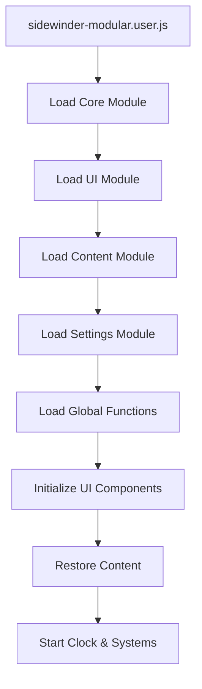

# 🦸 Sidewinder Modular Architecture Guide

## 📋 Overview

The Sidewinder sidebar has been restructured into a **modular architecture** that preserves the exact look and functionality of `sidekick-test.user.js` while making the code maintainable and extensible.

## 🏗️ Architecture Design

### Core Principle
**Separation of Concerns**: Each module handles a specific aspect of functionality, making it easier to maintain, debug, and extend without breaking other features.

### Module Structure
```
src/
├── modules/
│   ├── core.module.js           # Storage, notifications, templates
│   ├── ui.module.js             # UI creation, styling, layout
│   ├── content.module.js        # Content management (notepads, todos, attacks)
│   ├── settings.module.js       # Settings, API, data export/import
│   └── global-functions.module.js # Window functions for compatibility
├── sidewinder-modular.user.js   # Main launcher (loads all modules)
└── sidekick-test.user.js        # Original monolithic version
```

## 📦 Module Breakdown

### 1. **Core Module** (`core.module.js`)
**Purpose**: Foundation systems that all other modules depend on
- ✅ Storage system with profile support
- ✅ Notification system
- ✅ Data templates for notepads/todos/attacks
- ✅ Sidebar state management
- ✅ Profile-specific storage keys

**Exports**: `window.SidekickModules.Core`
```javascript
const { STORAGE_KEYS, saveState, loadState, NotificationSystem, DataTemplates } = window.SidekickModules.Core;
```

### 2. **UI Module** (`ui.module.js`)
**Purpose**: All visual elements and styling
- ✅ Complete CSS from sidekick-test.user.js (via GM_addStyle)
- ✅ Hamburger button creation
- ✅ Sidebar container and layout
- ✅ Add button and panel creation button
- ✅ Page navigation dots
- ✅ Responsive design and animations

**Exports**: `window.SidekickModules.UI`
```javascript
const UIManager = window.SidekickModules.UI;
UIManager.createSidebar();
```

### 3. **Content Module** (`content.module.js`)
**Purpose**: Content creation, management, and storage
- ✅ Add menu functionality
- ✅ Notepad creation and management
- ✅ Todo list with items
- ✅ Attack list with targets
- ✅ Page switching and content restoration
- ✅ Dynamic content loading

**Exports**: `window.SidekickModules.Content`
```javascript
const ContentManager = window.SidekickModules.Content;
ContentManager.addNotepad();
```

### 4. **Settings Module** (`settings.module.js`)
**Purpose**: Configuration, API integration, data management
- ✅ Settings modal
- ✅ API key management
- ✅ Torn API integration
- ✅ Data export/import
- ✅ Points price monitoring

**Exports**: `window.SidekickModules.Settings`
```javascript
const SettingsManager = window.SidekickModules.Settings;
SettingsManager.createModal();
```

### 5. **Global Functions Module** (`global-functions.module.js`)
**Purpose**: Backward compatibility and global access
- ✅ Window functions for content updates
- ✅ Clock functionality
- ✅ API testing functions
- ✅ Compatibility with existing storage

**Exports**: Direct window functions
```javascript
window.updateNotepadTitle(id, title);
window.showSettingsModal();
```

## 🚀 Main Launcher (`sidewinder-modular.user.js`)

The main file that:
1. **Loads all modules** via @require directives
2. **Waits for module initialization** 
3. **Coordinates startup sequence**
4. **Maintains sidekick-test.user.js compatibility**

## 🔄 Module Loading Sequence



## 🎯 Benefits of Modular Architecture

### ✅ **Maintainability**
- **Isolated Changes**: Fix notepad bugs without touching attack list code
- **Clear Responsibilities**: Each module has a single, well-defined purpose
- **Easier Debugging**: Problems are contained within specific modules

### ✅ **Extensibility**
- **Add New Features**: Create new modules without modifying existing ones
- **Plugin System**: Modules can be developed independently
- **Feature Toggles**: Disable modules by removing @require lines

### ✅ **Backward Compatibility**
- **Same Look & Feel**: Preserves all visual elements from sidekick-test.user.js
- **Same Functionality**: All features work exactly as before
- **Same Storage**: Uses identical storage keys and data structures

### ✅ **Development Workflow**
- **Team Development**: Multiple developers can work on different modules
- **Testing**: Test individual modules in isolation
- **Deployment**: Update only changed modules

## 🛠️ Development Guide

### Adding a New Feature Module

1. **Create the module file**:
```javascript
// new-feature.module.js
(function() {
    'use strict';
    
    function waitForCore(callback) {
        if (window.SidekickModules?.Core) {
            callback();
        } else {
            setTimeout(() => waitForCore(callback), 100);
        }
    }

    waitForCore(() => {
        const { NotificationSystem } = window.SidekickModules.Core;
        
        const NewFeature = {
            init() {
                console.log('New feature initialized');
            }
        };
        
        window.SidekickModules.NewFeature = NewFeature;
        console.log('✅ New feature module loaded');
    });
})();
```

2. **Add to main launcher**:
```javascript
// @require file://path/to/new-feature.module.js
```

3. **Update initialization**:
```javascript
const requiredModules = ['Core', 'UI', 'Content', 'Settings', 'NewFeature'];
```

### Modifying Existing Functionality

**Example**: Adding a new field to notepads

1. **Update Core Module** (data template):
```javascript
createNotepad(title = 'New Notepad') {
    return {
        id: Date.now() + Math.random(),
        title: title,
        content: '',
        tags: [],  // New field
        type: 'notepad',
        created: new Date().toISOString()
    };
}
```

2. **Update Content Module** (UI creation):
```javascript
createNotepadElement(notepad) {
    // Add tags input field to the innerHTML
    // Add event listeners for tags
}
```

3. **Update Global Functions** (if needed):
```javascript
window.updateNotepadTags = function(id, tags) {
    // Implementation
};
```

## 🔍 Debugging Guide

### Module Loading Issues
```javascript
// Check if modules are loaded
console.log('Modules:', Object.keys(window.SidekickModules || {}));

// Wait for specific module
function waitForModule(moduleName, callback) {
    if (window.SidekickModules?.[moduleName]) {
        callback();
    } else {
        setTimeout(() => waitForModule(moduleName, callback), 100);
    }
}
```

### Storage Debugging
```javascript
// Check stored data
const { loadState, STORAGE_KEYS } = window.SidekickModules.Core;
console.log('Pages:', loadState(STORAGE_KEYS.SIDEBAR_PAGES, []));
console.log('Current page:', loadState(STORAGE_KEYS.CURRENT_PAGE, 0));
```

### UI Issues
```javascript
// Check if UI elements exist
console.log('Sidebar:', document.getElementById('sidekick-sidebar'));
console.log('Hamburger:', document.getElementById('sidekick-hamburger'));
```

## 📊 Comparison: Monolithic vs Modular

| Aspect | Monolithic (sidekick-test.user.js) | Modular (sidewinder-modular.user.js) |
|--------|-----------------------------------|----------------------------------------|
| **File Size** | 2,705 lines in one file | 5 focused modules (200-400 lines each) |
| **Maintainability** | ❌ Hard to navigate and modify | ✅ Easy to find and fix specific issues |
| **Testing** | ❌ Must test entire system | ✅ Can test individual modules |
| **Collaboration** | ❌ Merge conflicts likely | ✅ Multiple developers can work simultaneously |
| **Performance** | ✅ Single file load | ✅ Modular loading (similar performance) |
| **Features** | ✅ All features included | ✅ All features preserved |
| **Look & Feel** | ✅ Original design | ✅ Identical appearance |

## 🚀 Usage Instructions

### For End Users
1. **Install the modular version**: Load `sidewinder-modular.user.js`
2. **Enjoy same functionality**: Everything works exactly like before
3. **Benefits**: More stable, fewer bugs, faster updates

### For Developers
1. **Edit specific modules**: Modify only what you need to change
2. **Test changes**: Test individual modules before deployment
3. **Add features**: Create new modules for new functionality

## 🎯 Future Roadmap

### Phase 1: Core Stability ✅
- ✅ Modular architecture implementation
- ✅ Feature parity with sidekick-test.user.js
- ✅ Backward compatibility

### Phase 2: Enhanced Features 🚧
- ⏳ Timer system module
- ⏳ Travel tracker module  
- ⏳ Points monitor module
- ⏳ Advanced API integration

### Phase 3: Advanced Systems 📋
- 📋 Plugin marketplace
- 📋 Theme system
- 📋 Cloud synchronization
- 📋 Advanced analytics

## 🤝 Contributing

The modular architecture makes contributing much easier:

1. **Pick a module** that needs improvement
2. **Make focused changes** within that module
3. **Test the module** independently
4. **Submit targeted pull requests**

## 🔗 File References

- **Main Launcher**: `sidewinder-modular.user.js`
- **Original Version**: `sidekick-test.user.js` (for reference)
- **Core Systems**: `modules/core.module.js`
- **User Interface**: `modules/ui.module.js`
- **Content Management**: `modules/content.module.js`
- **Settings & API**: `modules/settings.module.js`
- **Global Functions**: `modules/global-functions.module.js`

---

**This modular architecture provides the perfect balance between the robust functionality of sidekick-test.user.js and the maintainability needed for future development. You get the same great user experience with a much better development experience!**
